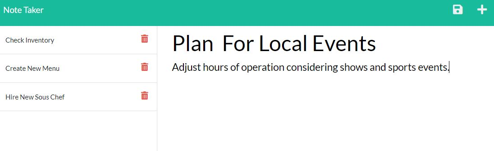

# Note Taker

## Description
  This application allows anybody to easly and effectively keep track of notes.

  ## Table of Contents
  *[Installation](#installation)

  *[Usage](#usage)

  *[Links](#links)

  ## Installation
This app can be run immediately from the Heroku website. For local use, Node.js and express.js are required.

  ## Usage
  From the landing page click the Get Started link. Simply type in the name of your note and the related message then press the save icon in the upper right corner. A list of previous notes will be populated to the right and can be accessed individually. Any note can be deleted by clicking the trash icon.
  

  ## Links

  [GitHub](https://github.com/Dustin2400/note-taker)

  [Heroku](https://pure-caverns-00713.herokuapp.com/)

##
  Made with ❤️ by Dustin Grijalva
